# TD : CI/CD avec GitHub Actions et Clever Cloud

## 🎯 Objectif du TD

Déployer automatiquement une application React sur Clever Cloud via un pipeline CI/CD avec GitHub Actions.

## 📋 Prérequis

- Compte GitHub personnel
- Compte Clever Cloud (gratuit) avec votre adresse `@3il.fr` : [Clever Cloud Console](https://console.clever-cloud.com/) 
- Git installé sur votre machine
- NodeJS installé en local (https://nodejs.org/fr/download)

## 🚀 Étapes du TD

### 1. Fork du projet

> Un fork est une copie complète d’un dépôt GitHub vers votre propre espace GitHub ; il vous permet d’expérimenter, de modifier le code et de pousser vos commits sans affecter le dépôt d’origine, tout en conservant un lien pour proposer ensuite des Pull Requests en amont.

1. Allez sur le repository GitHub du projet [https://github.com/CodinCloud/MyFITJob](https://github.com/CodinCloud/MyFITJob/tree/devops)

2. Cliquez sur "Fork" en haut à droite

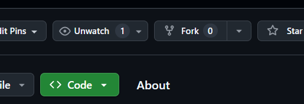

3. Valider le fork: 
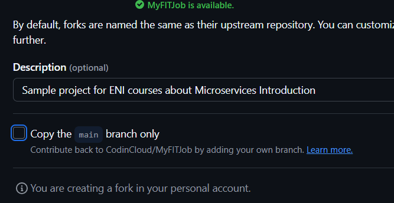

4. Clonez cette nouvelle version (de votre Github personel) en local :
   ```bash
   git clone https://github.com/VOTRE_USERNAME/MyFITJob.git
   cd MyFITJob
   ```

5. Valider que le projet fonctionne: 

- Checkout la branche 'devops' : `git checkout devops`
- Se rendre dans /src/MyFITJob.Frontend

```
npm i
npm run dev
```

*exemple:* 

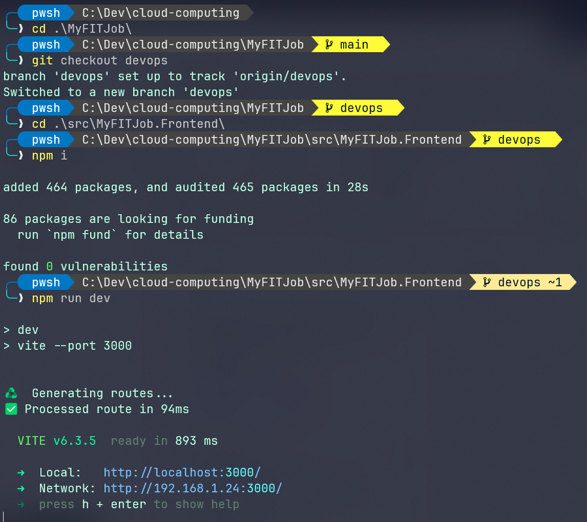

### 2. Configuration Clever Cloud

1. **Créer un compte Clever Cloud**
   - Allez sur [console.clever-cloud.com](https://console.clever-cloud.com/)
   - Créez un compte gratuit avec votre email de l'ENI

2. **Créer une application**
   - Dans la console Clever Cloud, cliquez sur "Create an application"
   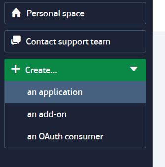
   - Choississez "Create an application from a Github repository" 
   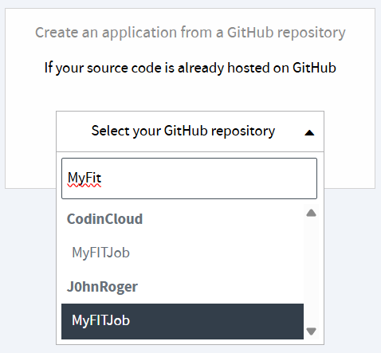
   - Selectionner le repo "fork" à l'étape précedente
   - Selectionner l'application Docker: 
   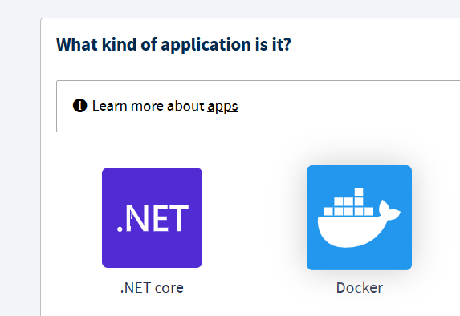
   - Pour la partie Scalabilité : Cliquer sur "Next" 
   - Nommez votre application : `myfitjob-frontend`
   - Cliquer sur "Create"
   - Cliquer sur "I don't need any Add-ons
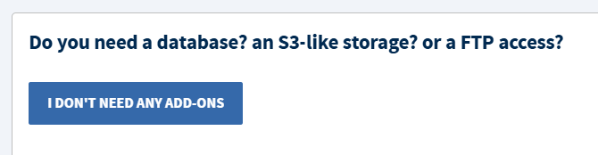
   - Variables d'env: cliquer sur Next  

Vous devriez avoir l'écran de chargement de l'application: 
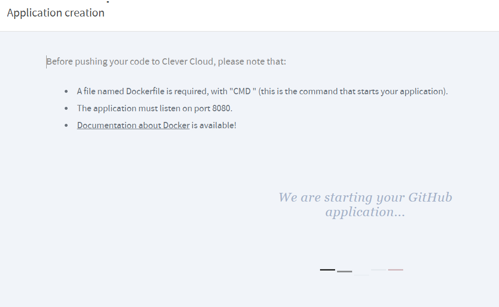

> A ce stade, vous devriez avoir une erreur 
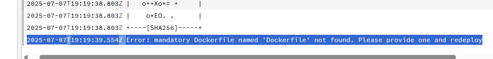

> Par défaut, Clever Cloud cherche à "build" à partir de la branche "main" du projet. Il faut donc ouvrir une Pull Request pour fusionner la branche de "devops" sur la branche "main", afin de déclencher un nouveau build

## Configurer la CI/CD dans Github 

> J'ai créé le fichier `.github/workflows/ci_cd_clever.yml` qui permet de déployer automatiquement l'application sur Clever Cloud à partir du package fourni par l'éditeur `clever-tools`. Si vous regardez ce fichier, vous verrez des references à des SECRETS (cf cours sur la sécurité). 

Nous allons renseigner ces informations sensibles dans le pipeline via l'interface de Github : 

Pour générer les valeurs de TOKEN et SECRETS, il faut les générer en local:

1. installer l'outil de clever-cloud de manière globale sur votre poste : 
`npm i -g clever-tools`  
2. Lancer la commande `clever login` 
3. Saisissez vos identifiants/mdp
Vous devriez être redirigé sur une page affichant votre TOKEN et votre SECRET

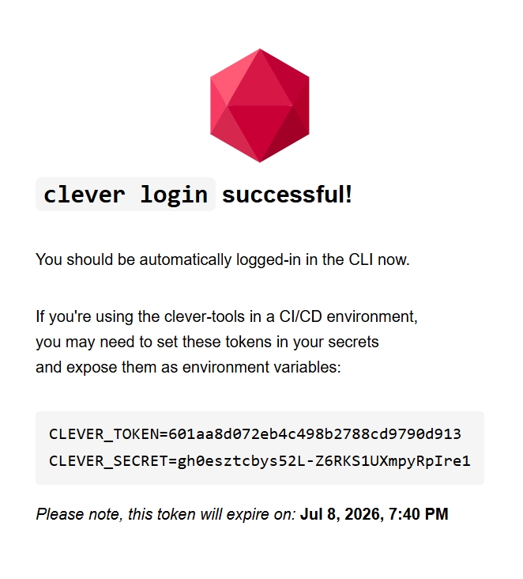

4. Noter les valeurs de CC_TOKEN et CC_SECRET

Nous allons renseigner ces 3 `secrets` dans votre repository Github :   

5. Se rendre dans les "Settings" de Github: 
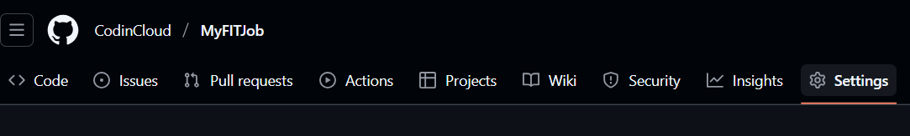

6. Dans le menu "Security", cliquer sur "Actions" 
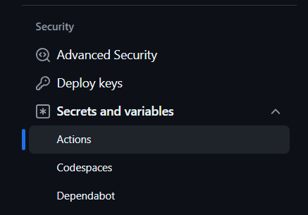
7. Cliquer sur "New Repository Secret"
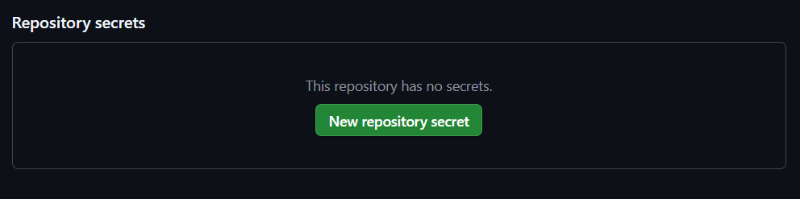

- Ajouter les secrets suivants: 

- `CLEVER_TOKEN` : Votre token Clever Cloud
- `CLEVER_SECRET` : Votre secret Clever Cloud

- `CC_APP_ID` : L'ID de votre application Clever Cloud

l'id de votre application `CC_APP_ID` est dans votre interface Clever Cloud : 
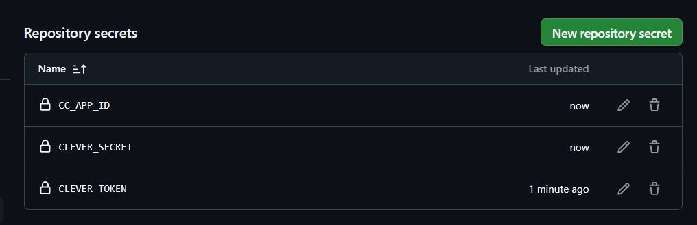

## Créer une PR sur votre repository Github 

1. Se connecter sur votre repository GitHub
2. Cliquer sur l'onglet "Pull Request"

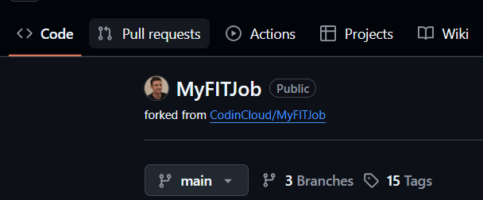

> Une Pull Request est une proposition de fusion (“merge”) d’une branche de travail vers la branche de référence (souvent main/master) dans un dépôt Git ; elle sert de point central pour la revue de code, la discussion et le déclenchement automatique de la CI/CD.


3. Nous allons faire une demande de fusion de notre branche `devops` qui contient le DockerFile à la racine du projet, vers la branche `main`


4. Selectionner la branche `devops`, Github vous affiche les 2 commit différents entre la branche `main` de référence et cette branche, ouvrir la pull request
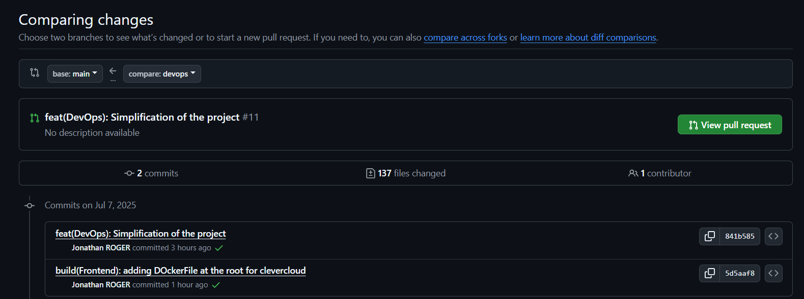

5. Une fois les check effectués: cliquer sur `Merge Pull Request`, puis `Confirm`

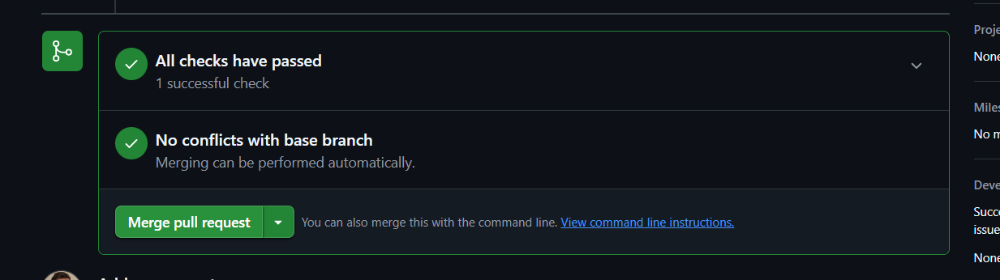

**Checkpoint:** 
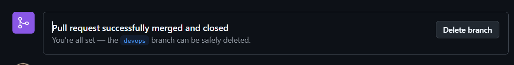

6. Se rendre dans l'onglet `Action` - vous devez voir le workflow `Github Action` tourner :
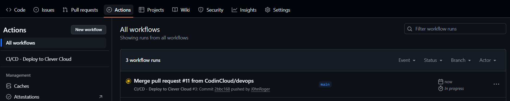

### 3. Configuration des secrets GitHub

   ### 4. Personnalisation de l'application

   1. **Modifier le header**
   - Ouvrez le fichier `src/MyFITJob.Frontend/src/components/Header.tsx`
   - Remplacez "TODO" par votre nom ou le nom de votre groupe
   - Committez vos changements :
   ```bash
   git add .
   git commit -m "feat: personnalisation du header avec mon nom"
   git push origin main
   ```

### 5. Test du pipeline CI/CD

1. **Créer une Pull Request**
   - Créez une nouvelle branche :
   ```bash
   git checkout -b feature/personnalisation
   ```
   - Faites une modification (par exemple, changez la couleur d'un élément)
   - Committez et poussez :
   ```bash
   git add .
   git commit -m "feat: modification pour tester le pipeline"
   git push origin feature/personnalisation
   ```
   - Créez une Pull Request sur GitHub

2. **Vérifier le déploiement**
   - Le pipeline GitHub Actions se déclenche automatiquement
   - Vérifiez que le build passe (icône verte)
   - L'URL de déploiement apparaîtra en commentaire de la PR

### 6. Vérification finale

1. **Accéder à l'application**
   - Cliquez sur l'URL fournie dans les commentaires de la PR
   - Vérifiez que l'application s'affiche correctement
   - Vérifiez que votre nom apparaît dans le header

2. **Tester les fonctionnalités**
   - Navigation dans l'application
   - Affichage des job offers (données mockées)
   - Graphiques d'analyse de marché

## ✅ Critères de réussite

- [ ] Le pipeline GitHub Actions passe (build vert)
- [ ] L'application est accessible via l'URL Clever Cloud
- [ ] Votre nom apparaît dans le header
- [ ] Les fonctionnalités (job offers, graphiques) fonctionnent
- [ ] Les données mockées s'affichent correctement

## 🔧 Dépannage

### Problème : Build échoue
- Vérifiez que tous les secrets sont configurés
- Vérifiez la syntaxe du code TypeScript

### Problème : Déploiement échoue
- Vérifiez les tokens Clever Cloud
- Vérifiez l'ID de l'application

### Problème : Application ne s'affiche pas
- Vérifiez les logs dans la console Clever Cloud
- Vérifiez que le fichier `.clever.json` est présent

## 📚 Ressources

- [Documentation Clever Cloud](https://www.clever-cloud.com/developers/doc/quickstart/)
- [GitHub Actions Documentation](https://docs.github.com/en/actions)
- [MSW Documentation](https://mswjs.io/)

## 🎉 Félicitations !

Vous avez réussi à mettre en place un pipeline CI/CD complet avec :
- Build automatique avec GitHub Actions
- Déploiement automatique sur Clever Cloud
- Tests et validation automatiques
- Personnalisation de l'application 